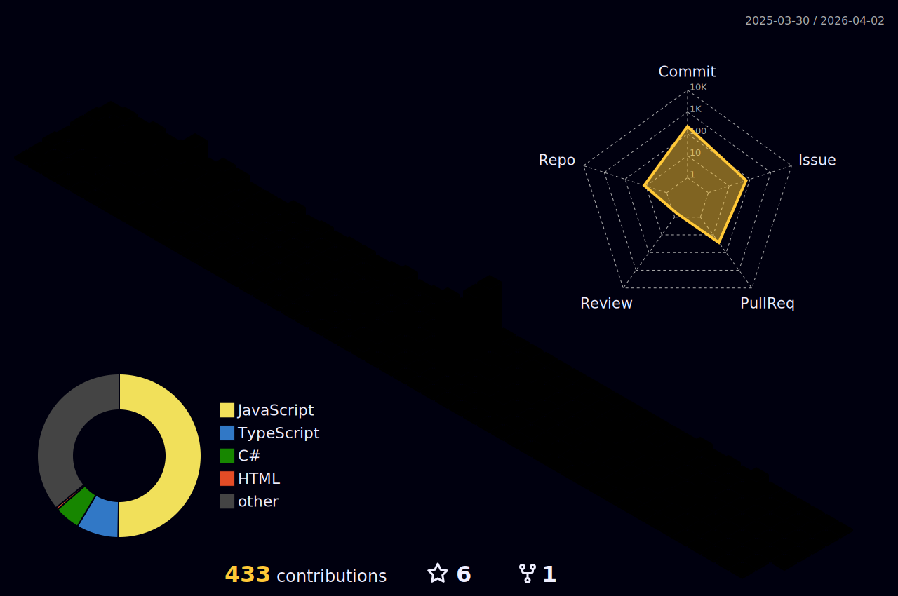

<p align="center">
  
</p>

## 🛠 **My Tools:**

<div align="center">


<br/>


<br/>


</div>

## ⚡ **My Stats:**

<div align="center">
<a href="https://github.com/yNakidori">
  
</div>




## 🛠 **My Workspace Specs:**

<div align="center">

## PC Specs 💻

- **Processor: Ryzen 9 7900X3D** 🔥  
  Unleashing extreme multi-core performance for gaming and development.

- **GPU: RTX 5080 Solid OC** 🚀  
  Delivering next-level graphics for game development and high FPS in competitive gaming.

- **Memory: 64GB Corsair Dominator Platinum** 💾  
  Blazing-fast, high-capacity RAM for smooth multitasking and handling intensive workloads.

---
This setup is ready for anything—from game dev to ranked matches, pushing performance to the limit!
Also using a Nitro 5


</div>


## 🔓 **About me:**

<div align="left">

<p>
  
```diff
# Welcome to Hell's Bird Nest 🪶

## About Me

- **Web Dev & Game Dev** 🖥️🎮  
  I work on both web and game development, exploring new technologies and pushing creative boundaries.

- **Modder & PC Builder** 🛠️  
  I love customizing hardware, building PCs, and squeezing out extra performance with casual overclocking.

- **Unity Developer** 🌐  
  Crafting immersive experiences using Unity.

- **React/JS/C# Developer** 💻  
  Building modern web applications and systems with React, JavaScript, and C#.

- **Ranked Player** 🎯  
  Competitive gaming is my passion—always striving for the top.

- **Dark Pop Enthusiast** 🎵  
  I have a love for dark pop music, which fuels my creative energy.

- **Hell's Bird Nest Leader** 🪶  
  Leading the flock—gaming, coding, and creativity at the core.

## Currently working on...
  An exciting new project—details still being written, but stay tuned!

```
</p>  
</div>

## ♥️ **Social:**

<div align="center">
  <a href="https://www.youtube.com/@Naki.Official" target="_blank"></a>
  <a href="https://www.instagram.com/iam.nakidori/" target="_blank"></a>
 	<a href="https://www.twitch.tv/ynakidori" target="_blank"></a>  
</div>

<div align="center">
  
  
</div>


</div>


